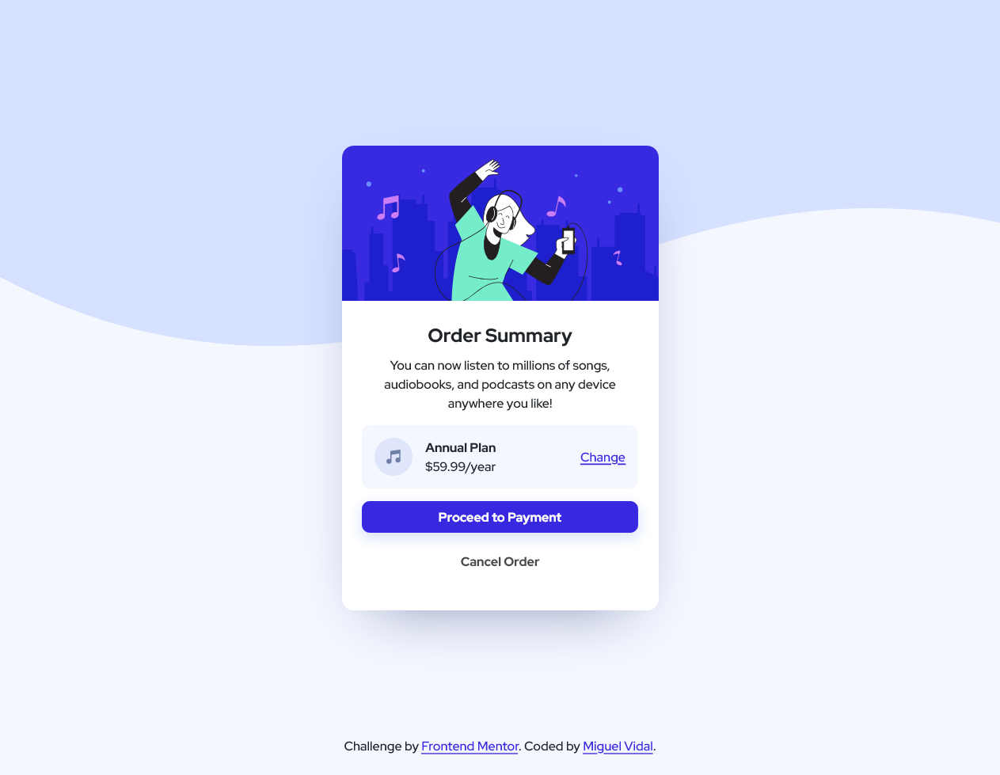

# Frontend Mentor - Order summary card solution

This is a solution to the [Order summary card challenge on Frontend Mentor](https://www.frontendmentor.io/challenges/order-summary-component-QlPmajDUj). Frontend Mentor challenges help you improve your coding skills by building realistic projects.

## Table of contents

- [Overview](#overview)
  - [The challenge](#the-challenge)
  - [Screenshot](#screenshot)
  - [Links](#links)
- [My process](#my-process)
  - [Built with](#built-with)
  - [What I learned](#what-i-learned)
  - [Useful resources](#useful-resources)
- [Author](#author)

## Overview

### The challenge

Users should be able to:

- See hover states for interactive elements

### Screenshot



### Links

- Solution URL: [https://github.com/migvidal/order-summary-component-main](https://github.com/migvidal/order-summary-component-main)
- Live Site URL: [https://migvidal.github.io/order-summary-component-main/](https://migvidal.github.io/order-summary-component-main/)

## My process

### Built with

- Semantic HTML5 markup
- Bootstrap CSS Reboot
- CSS Flexbox
- Sass

### What I learned

Animate button shadows that look realistic and coherent.

```css
button {
  &.primary {
    box-shadow: 0 6px 15px 3px $pale-blue;
    transition: box-shadow 0.1s ease-in, transform 0.1s ease-in;
    &:hover {
      box-shadow: 0 10px 30px 10px $pale-blue;
      transform: scale(1.03);
    }
  }
}
```

### Useful resources

- [W3Schools](https://www.w3schools.com)

## Author

- Website - [Miguel Vidal](https://migvidal.github.io)
- Frontend Mentor - [@migvidal](https://www.frontendmentor.io/profile/yourusername)
